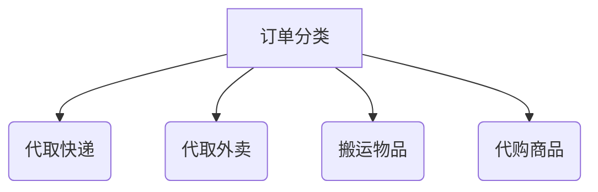

# 校园跑腿系统

基于SpringBoot + UniApp 微信小程序解决方案

## 🌟 核心功能

### 1. 用户服务

- **双身份融合**  
  同一账号拥有「发单人」与「接单人」两种角色，无需切换用户身份

### 2. 订单系统

| 功能     | 描述                     |
|--------|------------------------|
| 多媒介订单  | 支持文字描述+图片上传（快递面单/商品照片） |
| 实时状态追踪 | 可视化订单流程：待接单→进行中→已完成    |
| 订单评价   | 完成订单后可对接单人进行评价，提升服务质量  |

### 3. 支付与评价

- **微信支付集成**  
  担保交易模式，确认送达后资金划转
- **打赏机制**  
  支持额外打赏接单者

### 4. 特色模块


## 📚 项目结构

```plaintext

```

## 🔨 技术栈

- **前端框架**: uni-app + vue3
- **后端框架**: Spring Boot 3.5.0
- **构建工具**: Maven
- **数据库**: MySQL
- **缓存**: Redis
- **对象存储**: RustFS

## 🚀 快速开始