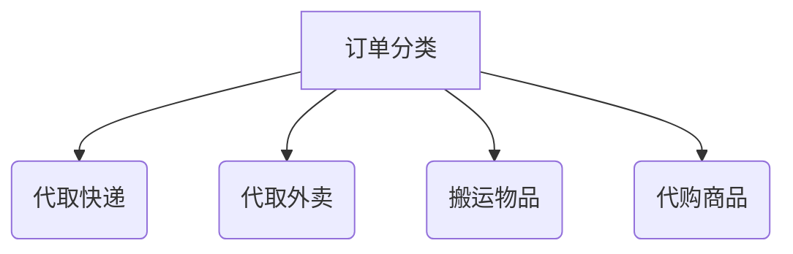

# 校园跑腿系统

基于SpringCloud + UniApp + RuoYi的微信小程序解决方案

## 🌟 核心功能

### 1. 用户服务

- **双身份融合**  
  同一账号拥有「发单人」与「接单人」两种角色，无需重复注册

- **黑名单机制**  
  可拉黑不良行为用户，自动过滤其订单

### 2. 订单系统

| 功能     | 描述                     |
|--------|------------------------|
| 多媒介订单  | 支持文字描述+图片上传（快递面单/商品照片） |
| 实时状态追踪 | 可视化订单流程：待接单→进行中→已完成    |
| 订单评价   | 完成订单后可对接单人进行评价，提升服务质量  |

### 3. 支付与评价

- **微信支付集成**  
  担保交易模式，确认送达后资金划转
- **打赏机制**  
  支持额外打赏接单者

### 4. 特色模块


## 📚 项目结构

```plaintext
├── .gitignore
├── README.md
├── backend
│   ├── .gitignore
│   ├── docker-compose.yml
│   ├── pao-gateway
│   │   ├── Dockerfile
│   │   ├── pom.xml
│   │   └── src
│   ├── pao-service
│   │   ├── pao-order-service
│   │   └── pom.xml
│   └── pom.xml
├── docs
│   └── erDiagram.mermaid
│   └── sequenceDiagram.mermaid
└── sql
    ├── t_cross_school_order.sql
    ├── t_dispatcher_info.sql
    ├── t_order.sql
    ├── t_order_log.sql
    ├── t_payment_record.sql
    └── t_school_relation.sql
```

## 🔨 技术栈

- **后端框架**: Spring Boot 3.3.7
- **微服务框架**: Spring Cloud 2023.0.3、Spring Cloud Alibaba 2023.0.3.2
- **服务发现与配置中心**: Nacos
- **网关**: Spring Cloud Gateway
- **熔断器**: Sentinel
- **构建工具**: Maven
- **数据库**: MySQL
- **前端框架**: uni-app

## 🚀 快速开始

1. 切换后端目录：
   ```bash
   cd backend
   ```
2. 构建项目：
   ```bash
   mvn clean install
   ```
3. 启动服务：
   ```bash
   docker-compose up -d
   ```

## 注意事项

- 数据库配置需根据实际情况修改 `application.yml` 文件。